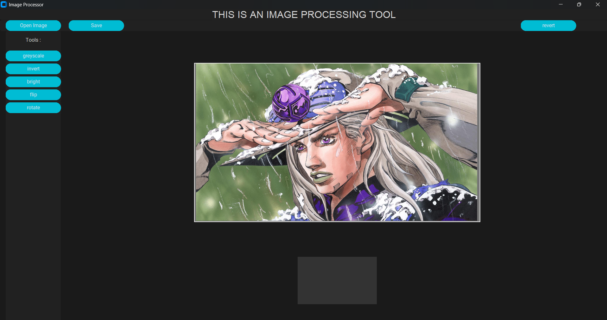

# Image Processing Tool

A desktop-based image processing application built using **Python**, **NumPy**, **Pillow (PIL)**, and **CustomTkinter**. This application provides an intuitive graphical interface for performing common image processing operations in real time, making image manipulation simple and accessible.

---

## Features

*  Upload images from local storage
*  Convert images to grayscale
*  Adjust image brightness
*  Flip images horizontally and vertically
*  Rotate images
*  Resize images while preserving aspect ratio
*  Real-time image preview
*  Simple and user-friendly desktop interface

---

## Tech Stack

* Python
* NumPy
* Pillow (PIL)
* CustomTkinter

---

## Project Structure

```text
Image-Processing-Tool/
│
├── main.py               # Main application
├── functions.py          # Image processing functions
├── new_ui.py             #  File containing UI functions and elements
└── README.md
```

---

## Installation

### 1. Clone the repository

```bash
git clone https://github.com/your-username/image-processing-tool.git
```

### 2. Navigate to the project directory

```bash
cd image-processing-tool
```

### 3. Install dependencies

```bash
pip install -r requirements.txt
```

### 4. Run the application

```bash
python main.py
```

---

## Screenshot

---
## Learning Outcomes

This project helped me strengthen my understanding of:

* Image representation using NumPy arrays
* Image manipulation with Pillow
* Desktop GUI development using Tkinter
* Event-driven programming in Python
* Writing modular and maintainable Python code
